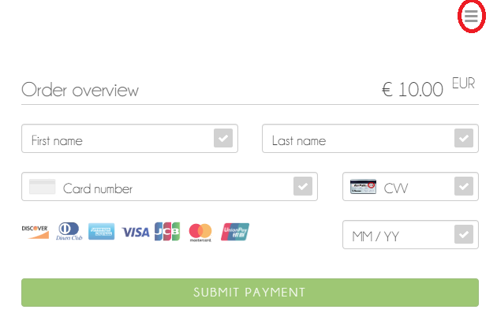

# Wirecard Payment Page Integration Demo with PHP

[](https://raw.githubusercontent.com/wirecard/wpp-integration-demo-php/master/LICENSE)
[](http://www.php.net)
[](http://www.php.net)
[](https://www.wirecard.com/)

This application demonstrates how to use the Wirecard Payment Page in PHP code.

## Requirements
* PHP
* curl extension

## Installation 
First install composer from [getcomposer.org](https://getcomposer.org/). Have a look and see how composer works. 

Next download or clone the wpp-integration demo to any directory you like. If you have downloaded the zip file, extract it.
Rename the extracted directory to `wpp-integration-demo-php` if it is not already set.

### Installing via composer
Open a command shell and navigate to the root path where you can find the composer.json and composer.lock files. 
These files are required to install the dependencies by composer. 
You can install these dependencies by entering the following command on your command line:

```composer install```

## Run
Copy this directory into a location where your webserver can serve it.  
In the example we assume that

* your web server runs at port 80,
* the application is in the directory `wpp-integration-demo-php` in the document root of your web server.

However, you are free to choose any port and any name for your project you are comfortable with.

### Successful payment
This application provides examples for several payment method. 
Click on this [link](#payment-method) to see a list of all supported payment method.  
For testing purposes you can use the data below.  
For further test data consult [our documentation](https://document-center.wirecard.com/display/PTD/Appendix+K%3A+Test+Access+Data+and+Credentials).

#### Credit Card
In order to execute a successful credit card payment you can use the following 3D test card:

````
First & last name: arbitrary
Credit card number (PAN): 4012000300001003
CVV: 003
Expiry date: arbitrary month / year in the future
````

#### SEPA Direct Debit
You can enter the following IBAN in the input mask.  
Optionally you can provide the IBAN in the request body, so that the payment will be executed without consumer interaction (so-called "silent pay").

```
"bank-account": {
      "iban": "DE42512308000000060004"
 }
```

#### Sofort 
```
Country: whatever you like  
Bank Name: Demo Bank
Reference Number: any alphanumeric combination with more than 3 characters
Password: any alphanumeric combination with more than 3 characters
Tan Code: 12345
```

#### PayPal
```
Email: paypal.buyer2@wirecard.com
Password: Wirecardbuyer
```

#### iDeal
No further test data needed.

#### Paysafecard
```
Test Voucher Code: 3105 6626 4830 5874
```

#### Przelewy24
No further test data needed.

#### EPS
Choose the Apotheker Bank and enter arbitrary account data.

#### Alipay Cross-border
```
Account name: alipaytest20091@gmail.com
Password: 111111
Captcha Code: 8888
Payment Password: 111111
```

### Failed payment
#### Standalone and embedded mode
In order to execute a failing payment you can use the following SSL test card:

````
First & last name: arbitrary
Credit card number (PAN): 4200000000000018
CVV: 018
Expiry date: arbitrary month / year in the future
````

#### Seamless
Submit the payment without filling the field "Last name".

### Cancelled payment
#### Standalone and embedded mode
After the payment form has been displayed

1. open the menu in the top right corner of the form
2. click on Cancel in the menu on the right side of the screen



## Types of integration

You can choose between 3 types of integration:

* [standalone](https://document-center.wirecard.com/display/PTD/Hosted+Payment+Page) (a.k.a. hosted): Your consumer gets redirected to a standalone payment page hosted independently of your checkout page.
* [embedded](https://document-center.wirecard.com/display/PTD/Embedded+Payment+Page): A payment form rendered over your checkout page as a modal window.
* [seamless](https://document-center.wirecard.com/display/PTD/Seamless+Mode): A card form seamlessly integrated into your checkout page. This type of integration is relevant only for credit card, not for the other payment methods.

You can find more details about the integration types in our [documentation](https://document-center.wirecard.com/display/PTD/Wirecard+Payment+Page).

This application provides an example for all 3 types of integration.

## The payment process

### Overview
1. Gathering the request data which is necessary for starting a payment request
2. Registering the payment -> You get a redirect URL.
3. Displaying the payment form to your consumer: Redirecting to the redirect URL or calling the appropriate function of WPP.
4. Your consumer enters the payment data (e.g. credit card number).

At this point the process gets different for the seamless integration and for the 2 other types of integration (standalone, embedded).

#### Standalone and embedded
5. When your consumer submits the payment data, the payment form sends it to WPP.
6. After the payment has been processed, your consumer gets redirected to one of the pages: success, fail or cancel.
7. Displaying a feedback to the consumer about the payment status.

#### Seamless
5. The consumer submits the payment data via a button on your checkout page. Thus you have to implement the code which sends the payment data to WPP.
6. After the payment has been processed, you get a response from WPP.
7. Displaying a feedback to the consumer about the payment status. (On the checkout page directly or on another page.)

### Gathering the request data
You can see examples for request data (standalone, embedded and seamless integration) in the folders `example-requests-standalone` and 
`example-requests-embedded`. Have a look at the json requests examples to get a better idea of how request data must be structured to be accepted by our servers.
In the folder `src/register/base.php` a UUID is generated and added to the chosen request data.

#### Request parameters which will be probably the same for all your requests:
* merchant-account-id
* success-redirect-url
* fail-redirect-url
* cancel-redirect-url
* frame-ancestor

#### Request parameters which are specific for a request:
* request-id
* transaction-type
* requested-amount
* payment-method(s)
* transaction-type

##### Request ID
This must be a unique identifier.

If you use the `uniqid` function, it is recommended to set the `$more_entropy` parameter to true to increase the likelihood of uniqueness. (See the [PHP Manual](http://php.net/manual/en/function.uniqid.php))

You can also use an arbitrary prefix e.g. an abbreviation for a department or your internal order number.

The whole request ID must not be longer than 64 characters.

#### Payment methods
This field is optional.

If you omit it:  
A payment method select page will be displayed to your customer with all the payment methods which are configured for you.

If you provide a payment method:  
Your consumer can use only this payment method,  
e.g. the credit card data entry form is displayed to them immediately.

```
"payment-methods": {
  "payment-method": [{
    "name": "creditcard"
  }]
},
```

This option is useful if you want to decide about the payment method on a per request basis. E.g. for purchases above EUR 100 you want to accept only credit card. For purchases from a specific country you want to allow only Paypal etc.

#### Request parameters which are specific for a type of integration
For the standalone integration you are ready to go.  
For the embedded and seamless integrations you need further request parameter(s).  
See also the examples in `src/register/embedded.php` and `src/register/seamless.php`

##### frame-ancestor option
In case of the embedded and seamless integration the payment form will be displayed as an iframe on your page.  
For this reason you have to provide the option `frame-ancestor` in your request with your root URL as value.

##### mode option
This option is necessary only for the seamless integration and must have the value `seamless`.

### Registering the payment
After you have gathered all the data necessary for the payment request, you have to send a POST request to the endpoint https://wpp-test.wirecard.com/api/payment/register (see the function `postRegisterRequest` in `src/register/base.php`)

If your request was not successful, the response will contain an `errors` array with codes and descriptions.

```
{ 
  "errors" : [ 
    { 
      "code" : "E7001", 
      "description" : "Violation of field payment.requestedAmount.currency: size must be between 3 and 3" 
    },
    { 
      "code" : "E7001",
      "description" : "Requested payment method is not supported." 
    } 
  ] 
}
```

If your request was successful, the response contains a payment-redirect-url.

```
{ 
  "payment-redirect-url" : "https://wpp-test.wirecard.com/?wPaymentToken=eQloDaTU-QvoBx6msZ-fYLiKMn6JzCME0v7_TT0vdUM" 
}
```

This is the URL for the payment form of this specific payment. For this reason we store this payment-redirect-url in the session, and we will use it in the next step.

### Displaying the payment form to your consumer
This step is different depending on the type of your integration.

#### Standalone
Your consumer will enter their payment data on a standalone payment page hosted independently of your checkout page. You have to redirect your consumer to this payment page, to the payment-redirect-url.

#### Embedded
* reference the WPP JavaScript: `https://wpp-test.wirecard.com/loader/paymentPage.js`
* call the function `WPP.embeddedPayUrl` with your payment-redirect-url as a parameter

For an example see `src/payment/embedded.php`

#### Seamless
* reference the WPP JavaScript: `https://wpp-test.wirecard.com/loader/paymentPage.js`
* call the function `WPP.seamlessRender` with the following parameters
  * wrappingDivId: the ID of the div where the iframe with the payment form should be displayed
  * url: your payment-redirect-url
  * onSuccess: a function which will be executed, if the payment form has been rendered successfully. (Most of the times a logging is sufficient.)
  * onError: a function which will be executed, if the payment form has NOT been rendered. (You'll probably want to show a meaningful error message to your consumer.)

For an example see `src/payment/seamless.php`

### Receiving information about the outcome of the payment
Basically a payment can have 3 status:

* success
* failed
* cancelled

#### Standalone and embedded
The payment is posted and processed by WPP.  
After WPP has determined the payment status,  
it redirects your consumer to the respective URL.  
(`success-redirect-url`, `fail-redirect-url` and `cancel-redirect-url` have been provided in the register request.)

You can display a message to your consumer on these pages.

#### Seamless
The payment is posted by the JavaScript code on your side (the `WPP.seamlessSubmit` function), thus you also get the response from WPP.  
In the `WPP.seamlessSubmit` function you can also provide the `onSuccess` and `onError` functions as parameters.

You can display a message to your consumer on the checkout page or you can redirect them to another URL.

### Get notifications

You will be informed about the outcome of a settlement. A notification response is sent to a customized URL address.
Here you can see an example how a notify respond could look like. 
Please consider that the response could contain more fields like shipping or pos-transaction related
information and depends on the payment method.

```
{
  "payment": {
    "statuses": {
      "status": [
        {
          "code": "201.0000",
          "description": "paypal:The resource was successfully created.",
          "severity": "information",
          "provider-transaction-id": "5D350213JP141252A"
        }
      ]
    },
    "merchant-account-id": {
      "value": "2a0e9351-24ed-4110-9a1b-fd0fee6bec26"
    },
    "transaction-id": "978cc9d8-0530-4b9e-9cfc-9af5691f1328",
    "request-id": "payment_request_5b7fc2a1a90836.41860468",
    "transaction-type": "debit",
    "transaction-state": "success",
    "completion-time-stamp": 1535099576000,
    "requested-amount": {
      "value": 1.010000,
      "currency": "EUR"
    },
    "parent-transaction-id": "48b0ad1a-e35a-4354-87a3-d20de19c8fce",
    "account-holder": {
      "email": "paypal.buyer2@wirecard.com",
      "first-name": "Wirecardbuyer",
      "last-name": "Spintzyk"
    },
    "custom-fields": {
      "custom-field": []
    },
    "payment-methods": {
      "payment-method": [
        {
          "name": "paypal"
        }
      ]
    },
    "cancel-redirect-url": "wpp-integration-demo-php/src/result/cancel.php",
    "fail-redirect-url": "wpp-integration-demo-php/src/result/fail.php",
    "success-redirect-url": "wpp-integration-demo-php/src/result/success.php",
    "provider-account-id": "00000031718207D5"
  }
}
``` 

To get informed you have to define the notification URL where the response should be sent. You can also specify the
format of the response.

```
"notifications": {
      "format": "application/xml",
      "notification": [
        {
          "url": "wpp-integration-demo-php/src/result/notify.php"
        }
      ]
    }
```

## Payment method

The following payment methods are currently supported:

* Credit Card
* PayPal
* SEPA Direct Debit
* iDEAL
* Sofort. (Klarna Group)
* Paysafecard
* Przelewy24
* EPS
* Alipay Cross-border

You will find examples for each payment method in this demo project.  

### Hobex
You can register SEPA Direct Debit payments via the Austrian acquirer Hobex.
If you use Hobex you have to choose `hobex-vt` as payment method instead of `sepadirectdebit`.
Additional fields `order-number`, `creditor-id` and `country` are required.

| Field | Description |
| ----- | ----------- |
| order-number | Merchant-side order number. Allowed characters: a-z, A-Z, 0-9. |
| creditor-id | The hobex AG creditor ID (always "AT94ZZZ00000001251"). |
| country | A 2-letter code, representing the first two characters of the consumer's IBAN. |

#### Available countries for Hobex 
* AT (Austria)
* CZ (Czech Republic)
* DE (Germany)
* IT (Italy)
* NL (Netherlands)
* SI (Slovenia)

 Please note that the only available payment currency for consumers is EUR (€).
 
### Credit card brands

The test merchant used in these examples has only some very popular credit card brands configured. For a list of all supported credit card brands see our [documentation](https://document-center.wirecard.com/display/PTD/Wirecard+Payment+Page).

## Queries and further operations
For queries and further operations we recommend to use the [Payment SDK for PHP](https://github.com/wirecard/paymentSDK-php) library.  
For the most common use cases we provide examples in this project. You can find further examples in the [wiki of the Payment SDK for PHP](https://wirecard.github.io/paymentSDK-php/examples/)

### The most common queries

#### Find a transaction
* by transaction ID
* by request ID

#### Find a group of transactions
* by transaction ID

### The most common follow-up operations by payment methods

#### Credit card
* reserve
* payment / capture based on a reservation
* create a recurring payment based on an existing payment
* cancelling a payment

#### PayPal
* cancelling a payment
* credit: transfer funds to a PayPal account

#### Sofort.
* credit: refund a payment via SEPA credit transfer

#### iDEAL
* credit: refund a payment via SEPA credit transfer

#### Paysafecard
* Capture the reserved amount
* Cancel the reserved amount

#### Przelewy24
* Cancel a payment

#### Alipay Cross-border
* Cancel a payment
